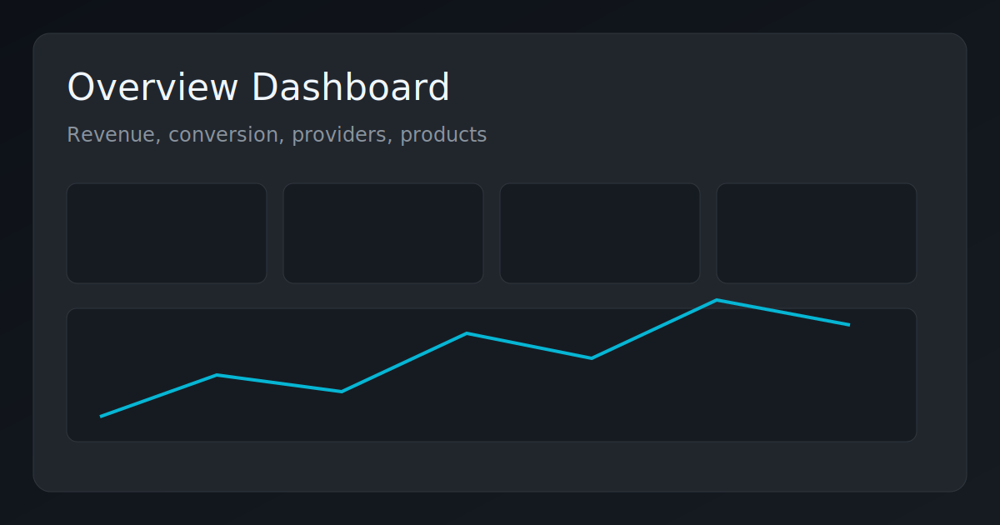
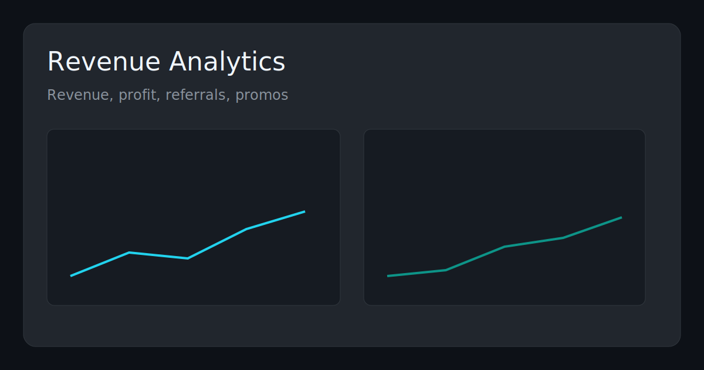
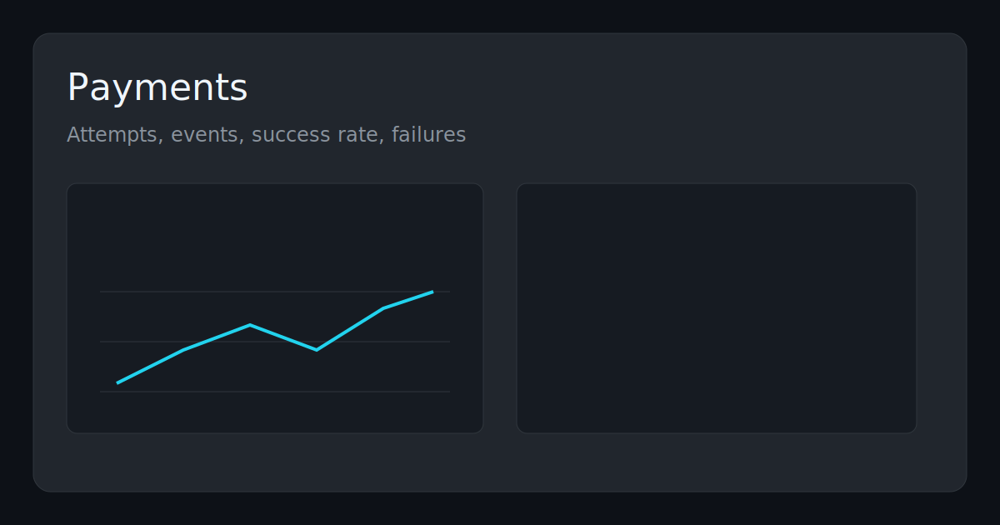

# more-stars-analytics

Отдельный Ruby/Rails сервис аналитики для экосистемы `more-stars`.

Проект добавляет полноценный back-office слой поверх существующего core backend:
- читает доменные данные из PostgreSQL (`orders`, `users`, `promos`, payments, referrals),
- считает аналитические агрегаты в `analytics_*` таблицы,
- отдает read-only API для отчетов,
- предоставляет web-панель с метриками и операционным контролем.

## Что внутри

- Дневные бизнес-метрики: заказы, выручка, себестоимость, прибыль, конверсии
- Разрезы по провайдерам и продуктам
- Реферальная и промо-аналитика
- Когорты и retention
- Проверки качества данных + журнал джобов
- Встроенная панель:
  - `/dashboard`
  - `/dashboard/revenue`
  - `/dashboard/users`
  - `/dashboard/payments`
  - `/dashboard/ops`
- Авторизация панели: пароль + 2FA (Google Authenticator, TOTP)

## Технологии

- Ruby `3.3.1`
- Rails `7.1` (API mode + static dashboard pages)
- PostgreSQL
- Sidekiq + Redis
- Docker / Docker Compose
- RSpec

## Архитектура

1. `more-stars` (FastAPI) остается source of truth и пишет доменные данные в PostgreSQL.
2. `more-stars-analytics` читает эти таблицы в read-only режиме.
3. Sidekiq/ETL-джобы собирают агрегаты в `analytics_*`.
4. API и UI читают уже готовые агрегаты (быстро и дешево для БД).

Ключевые aggregate таблицы:
- `analytics_daily_metrics`
- `analytics_provider_daily_metrics`
- `analytics_product_daily_metrics`
- `analytics_referral_daily_metrics`
- `analytics_promo_daily_metrics`
- `analytics_cohort_weekly_metrics`
- `analytics_data_quality_issues`
- `analytics_job_runs`

## Скриншоты панели






Можно заменить `.svg` на реальные `.png` и оставить те же пути.

## Локальный запуск

1. Подготовить env:
```bash
cp .env.example .env
```

2. Запустить контейнеры:
```bash
docker compose up -d --build
```

3. Выполнить миграции:
```bash
docker compose run --rm app bundle exec rails db:migrate
```

4. Сгенерировать 2FA secret:
```bash
docker compose run --rm app bundle exec rake auth:generate_2fa_secret
```

5. Добавить `DASHBOARD_2FA_SECRET` в `.env` и перезапустить:
```bash
docker compose up -d --build
```

6. Открыть:
- `http://localhost:3001/login`
- `http://localhost:3001/dashboard`

Важно:
- для локалки: `SESSION_COOKIE_SECURE=false`
- для production под HTTPS: `SESSION_COOKIE_SECURE=true`

## Подключение реальных данных (опционально)

Если есть дамп core БД:
```bash
docker cp ./dumps/more_stars_core.dump more-stars-analytics-db-1:/tmp/more_stars_core.dump
docker exec -i more-stars-analytics-db-1 pg_restore \
  -U analytics \
  -d more_stars \
  --clean \
  --if-exists \
  --no-owner \
  --no-privileges \
  /tmp/more_stars_core.dump
```

После этого пересчитать агрегаты:
```bash
docker compose run --rm app bundle exec rake analytics:backfill_full FROM=2026-01-01 TO=2026-03-31
```

## Production deployment

Используется `docker-compose.server.yml`.

Типовой запуск на сервере:
```bash
docker compose -f docker-compose.server.yml up -d --build
docker compose -f docker-compose.server.yml run --rm app bundle exec rails db:migrate
docker compose -f docker-compose.server.yml run --rm app bundle exec rake analytics:backfill_full FROM=2026-01-01 TO=2026-03-31
```

## Безопасность

- Вход в панель: `DASHBOARD_PASSWORD` + `DASHBOARD_2FA_SECRET`
- Session-based auth для `/dashboard*` и JSON API
- Опционально `INTERNAL_API_TOKEN` для machine-to-machine интеграций

## Основные env-переменные

См. `.env.example`.

Ключевые:
- `DATABASE_URL`
- `REDIS_URL`
- `SECRET_KEY_BASE`
- `DASHBOARD_PASSWORD`
- `DASHBOARD_2FA_SECRET`
- `TOTP_ISSUER`
- `SESSION_TTL_HOURS`
- `SESSION_COOKIE_SECURE`
- `GIFT_DEFAULT_COST_RUB` (fallback себестоимость `gift`)
- `INTERNAL_API_TOKEN`

## API (основные endpoint'ы)

- `GET /health`
- `GET /metrics/daily`
- `GET /metrics/summary`
- `GET /metrics/providers`
- `GET /metrics/products`
- `GET /metrics/referrals`
- `GET /metrics/promos`
- `GET /metrics/cohorts`
- `GET /metrics/funnel`
- `GET /metrics/payments`
- `GET /metrics/insights`
- `GET /metrics/users`
- `GET /metrics/users/details`
- `GET /metrics/daily/details`
- `GET /ops/jobs`
- `GET /ops/data-quality`
- `POST /ops/backfill`
- `POST /ops/data-quality/run`
- `GET /exports/metrics`

## CI/CD

Workflow'ы:
- `CI` (`.github/workflows/ci.yml`) — тесты и миграции
- `Deploy` (`.github/workflows/deploy.yml`) — ручной деплой по SSH

Secrets для Deploy:
- `DEPLOY_HOST`
- `DEPLOY_USER`
- `DEPLOY_SSH_KEY`
- `DEPLOY_PATH`

## Roadmap

- алерты (Telegram/email)
- расширенная anomaly detection
- RBAC и audit trail
- планировщик регулярных отчетов
- углубленная funnel/event аналитика

## License

Рекомендуется добавить `MIT` как лицензию для публичного pet-проекта.
