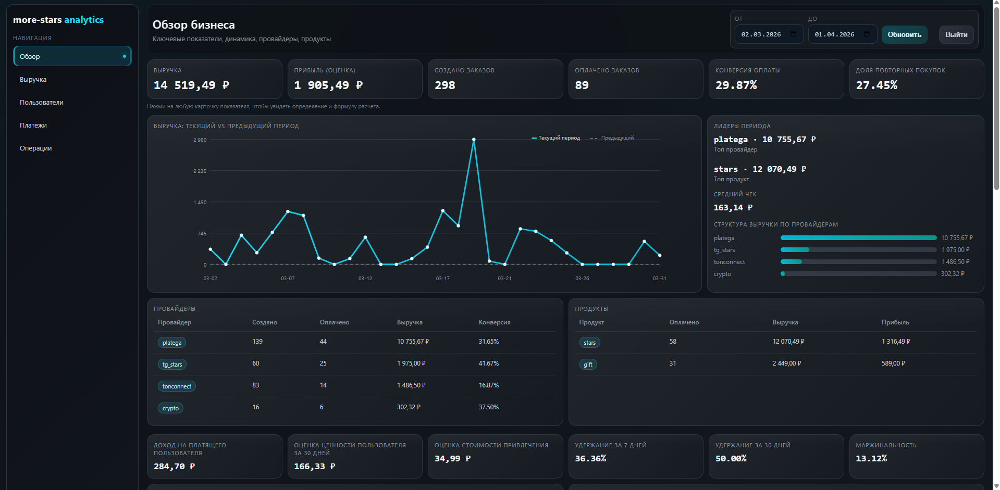

# more-stars-analytics

[](https://www.ruby-lang.org/)
[](https://rubyonrails.org/)
[](https://www.postgresql.org/)
[](https://sidekiq.org/)
[](https://www.docker.com/)
[](https://panel.more-stars.online)

Профессиональный аналитический сервис на Ruby/Rails для экосистемы **more-stars**.

Отдельный runtime-контур, который:
- не вмешивается в core checkout/payments логику;
- считает предагрегированные витрины метрик;
- отдает быстрый API и защищенную back-office панель.



## Что это за проект

`more-stars-analytics` — это выделенный back-office слой, который:
- читает продуктовые и платежные данные из PostgreSQL,
- пересчитывает готовые агрегаты в собственные `analytics_*` таблицы,
- отдает быстрый read-only API,
- предоставляет защищенную web-панель аналитики.

Ключевой принцип:  
**FastAPI backend остается source of truth**, а analytics сервис отвечает за отчетность, метрики и диагностику.

## Почему это сильный проект

- Четкое разделение ответственности между боевым контуром и аналитикой.
- Предрасчет агрегатов вместо тяжелых raw-join запросов на каждый API вызов.
- Идемпотентные backfill-процессы (upsert по уникальным ключам).
- Закрытый доступ: пароль + TOTP 2FA + сессионная авторизация.
- Production-ready запуск через Docker Compose + Nginx + HTTPS.
- Базовый CI/CD через GitHub Actions и remote deploy по SSH.

## Реализованный функционал

### 1) Метрики бизнеса
- дневные показатели заказов и оплат;
- выручка, себестоимость, прибыль;
- средний чек и конверсия оплаты;
- повторные покупки и уникальные покупатели.

### 2) Разрезы аналитики
- по платежным провайдерам;
- по типам продукта;
- по реферальным метрикам;
- по промокодам;
- по когортам (retention/repeat dynamics).

### 3) Операционный контур
- история запусков аналитических джобов;
- проверки качества данных;
- ручной запуск backfill и проверок.

### 4) Расширенная UI-панель
- отдельные страницы: Overview / Revenue / Users / Payments / Ops;
- drilldown по дням и пользователям;
- графики, таблицы, сравнение периодов;
- объяснение ключевых метрик в интерфейсе.

### 5) Безопасность доступа
- вход по паролю (`DASHBOARD_PASSWORD`);
- 2FA через Google Authenticator (`DASHBOARD_2FA_SECRET`);
- session auth для dashboard и API;
- опциональный `INTERNAL_API_TOKEN` для machine-to-machine вызовов.

## Архитектура данных

Сервис пишет агрегаты в:
- `analytics_daily_metrics`
- `analytics_provider_daily_metrics`
- `analytics_product_daily_metrics`
- `analytics_referral_daily_metrics`
- `analytics_promo_daily_metrics`
- `analytics_cohort_weekly_metrics`
- `analytics_data_quality_issues`
- `analytics_job_runs`

### Важная бизнес-логика

- Статусы заказов маппятся через конфигурацию статусов.
- Late updates учитываются за счет повторных rolling пересчетов.
- Для `gift` поддержан fallback себестоимости (`GIFT_DEFAULT_COST_RUB`, по умолчанию `60`), чтобы не искажать прибыль.

## API (основные endpoint’ы)

- `GET /health`
- `GET /metrics/daily`
- `GET /metrics/daily/details`
- `GET /metrics/summary`
- `GET /metrics/providers`
- `GET /metrics/products`
- `GET /metrics/referrals`
- `GET /metrics/promos`
- `GET /metrics/cohorts`
- `GET /metrics/funnel`
- `GET /metrics/payments`
- `GET /metrics/insights`
- `GET /metrics/users`
- `GET /metrics/users/details`
- `GET /ops/jobs`
- `GET /ops/data-quality`
- `POST /ops/backfill`
- `POST /ops/data-quality/run`
- `GET /exports/metrics`

## Локальный запуск

```bash
cp .env.example .env
docker compose up -d --build
docker compose run --rm app bundle exec rails db:migrate
docker compose run --rm app bundle exec rake auth:generate_2fa_secret
docker compose up -d --build
```

После этого:
- `http://localhost:3001/login`
- `http://localhost:3001/dashboard`

## Подключение реальных данных

Если есть dump core базы:

```bash
docker cp ./dumps/more_stars_core.dump more-stars-analytics-db-1:/tmp/more_stars_core.dump
docker exec -i more-stars-analytics-db-1 pg_restore \
  -U analytics \
  -d more_stars \
  --clean \
  --if-exists \
  --no-owner \
  --no-privileges \
  /tmp/more_stars_core.dump
```

Полный пересчет:

```bash
docker compose run --rm app bundle exec rake analytics:backfill_full FROM=2026-01-01 TO=2026-03-31
```

## Продакшн-развертывание

Используется `docker-compose.server.yml`.

Типовой production flow:

```bash
docker compose -f docker-compose.server.yml up -d --build
docker compose -f docker-compose.server.yml run --rm app bundle exec rails db:migrate
docker compose -f docker-compose.server.yml run --rm app bundle exec rake analytics:backfill_full FROM=2026-01-01 TO=2026-03-31
```

Рекомендуемый фронт-доступ: Nginx reverse proxy + TLS (Let's Encrypt).

## CI/CD

### CI
`.github/workflows/ci.yml`
- поднимает PostgreSQL и Redis service-контейнеры;
- выполняет миграции;
- запускает RSpec.

### Deploy
`.github/workflows/deploy.yml`
- ручной запуск (`workflow_dispatch`);
- проверка deploy secrets;
- SSH deploy на сервер;
- обновление контейнеров + миграции.

## Конфигурация через ENV

Ключевые переменные:
- `DATABASE_URL`
- `REDIS_URL`
- `SECRET_KEY_BASE`
- `DASHBOARD_PASSWORD`
- `DASHBOARD_2FA_SECRET`
- `TOTP_ISSUER`
- `SESSION_TTL_HOURS`
- `SESSION_COOKIE_SECURE`
- `GIFT_DEFAULT_COST_RUB`
- `INTERNAL_API_TOKEN` (опционально)

Полный список: `.env.example`.

## Структура репозитория

```text
app/
  controllers/
  jobs/
  models/
  services/
config/
db/migrate/
public/panel/
public/auth/
lib/tasks/
spec/
.github/workflows/
```

## Roadmap

- расширенные алерты (Telegram/email);
- RBAC и audit trail действий в панели;
- планировщик регулярных отчетов;
- углубленная event/funnel аналитика;
- расширенный anomaly detection.

## License

MIT.
